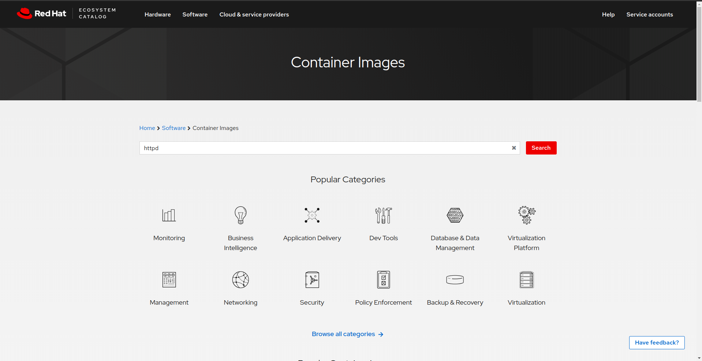

# Registry

Quando si parla di containers si parla anche di Images (o base image) ossia di template, che già includono runtime o librerie che ci possono servire, su cui poi possiamo costruire i nostri containers con le nostre aggiunte.

Se volessimo utilizzare un'analogia, potremmo vederlo nell'ottica della cucina: per cucinare un piatto (il nostro container) partiamo da degli ingredienti di base(le immagini). E dove andiamo a prendere questi ingredienti?
Se vogliamo prendere degli ingredienti per cucinare un nostro piatto andiamo, ovviamente, al supermercato di fiducia a prenderli.

Allo stesso modo, se vogliamo prendere delle immagini di base per i nostri container, li possiamo andare a prendere dai "supermercati" dei container, ossia i Registries.

Un registry è da dove recuperiamo delle immagini fidate che possiamo utilizzare liberamente.
I registry più usati sono:

 - **Red Hat Container Catalog**: Qui vengono ci sono tutte le immagini fidate e certificate da Red Hat o dai suoi partner, in cui possiamo anche vedere il grado di "salute" del container (inteso come presenza o meno di bug di sicurezza).
 
 - **Red Hat Quay**: Registry aperto al pubblico di Red Hat, in cui vi è però un minor controllo su ciò che viene caricato, anche se anche qui viene controllata la presenza o meno di alcuni bug con Clair.
 
 - **Docker Hub**: Registry gestito dalla Docker Inc., aperto al pubblico, senza alcun particolare controllo su ciò che viene caricato.

## Come interagire con un registry

Bene, ora vogliamo scaricare delle immagini per i nostri container. Come facciamo?

### Basic: Con un browser!

Per cercare dall'interfaccia web ci basta usare un browser.

Aprendo il nostro browser e aprendo il registry, ad esempio, di [Red Hat Container Catalog](https://catalog.redhat.com/software/containers/explore) possiamo cercare una immagine che ci serve.

Ad esempio, proviamo a cercare un'immagine per httpd:



Otteniamo così una lista delle immagini che corrispondono al criterio di ricerca:


Selezionandone una, ad esempio `rhel8/httpd-24`, possiamo vederne una descrizione sotto la scheda *Overview*


Nella scheda *Get This Image* possiamo vedere diversi modi di usare questa immagine:


Tra cui anche quella da usare con podman:


### Avanzato: Con podman!

Se invece vogliamo fare tutto tramite il terminale, possiamo tranquillamente usare podman anche per questo con il sottocomando `podman search`.

**N.B.** Nel caso di registry con autenticazione, ad esempio quello di Red Hat, bisogna prima fornire le credenziali:

```bash
# Login ad un registry
$ podman login registry.redhat.io
Username: [redhat_username]
Password: [redhat_password]
```

Possiamo poi cercare i container con i seguenti comandi:

```bash
# Ricerca tra tutti i registry configurati
$ podman search httpd
```

```bash
# Ricerca in un registry specifico
$ podman search registry.redhat.io/httpd
```
