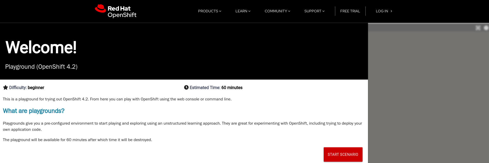

## Openshift Playground - KataCoda Containers

Un ottimo modo per iniziare, senza necessità di registrarsi, si va a sfruttare un ambiente sandbox con un mini cluster openshift provisionato automaticamente dove sarà possibile iniziare da subito ad eseguire i primi comandi e muovere i primi passi sulla **command line di Openshift**.
Il playground è basato su KataCoda Containers, e permette di utilizzare ambienti di diverso tipo direttamente all'interno del nostro browser.

Per accedervi, è sufficiente collegarsi al link che segue:
https://www.openshift.com/learn/courses/playground/

Una volta aperto il link, atterreremo sulla pagina iniziale, dove ci viene descritto il contenuto dello "**Scenario**" e veniamo informati che l'ambiente rimarrà attivo per un'ora, prima di essere distrutto.  
Per iniziare basta cliccare su "Start Scenario":

Verremo trasportati nella pagina di caricamento:

E finalmente saremo pronti ad utilizzare i comandi che vedremo insieme!

Vengono messe a disposizione due utenze:
- **developer/developer** - con accesso ridottto
- **admin/admin** - con privilegi di amministratore

Inoltre, potremo utilizzare i tab presenti nella sezione destra per muoverci tra il terminale:

E la console web:

Esattamente come una reale installazione, tutto nel nostro browser!

